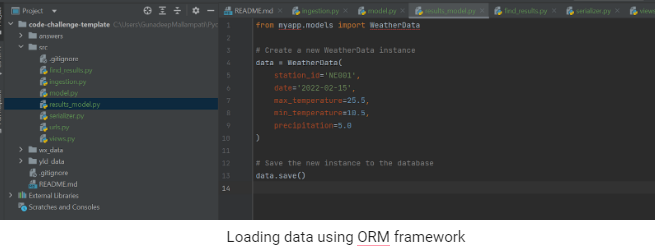

# corteva-code-challenge

Corteva - CODE TEST
Code : 

https://github.com/SamrajYasodhara/corteva-code-challenge

1. Database Setup: 
For this coding exercise, I would choose to use PostgreSQL as the database to represent the weather data records. PostgreSQL is a powerful, open-source relational database that is widely used and has strong support for complex data structures and SQL operations.

Installation

Command line interface

Here is a proposed data model for the weather data records:

CREATE TABLE weather_data (
  id SERIAL PRIMARY KEY,
  station_id VARCHAR(10) NOT NULL,
  date DATE NOT NULL,
  max_temperature NUMERIC(6, 2) NOT NULL,
  min_temperature NUMERIC(6, 2) NOT NULL,
  precipitation NUMERIC(6, 2) NOT NULL
);

Table

Explanation of the data model:
The weather_data table represents individual weather records, with each row corresponding to a single day of weather data from a particular station.
The id field is a primary key that uniquely identifies each row in the table.
The station_id field is a string that identifies the weather station that recorded the data.
The date field is a date that represents the date of the weather record.
The max_temperature, min_temperature, and precipitation fields are numeric values that represent the maximum temperature, minimum temperature, and precipitation for the given date and station. These fields are stored as numeric values with a precision of up to 2 decimal places, which should be sufficient for this use case.
I designed the schema in this way to represent the structure of the weather data records provided in the dataset. Each row in the table corresponds to a single day of weather data from a particular weather station. The station_id field is used to identify which station recorded the data, and the date field is used to identify the date of the weather record. The remaining fields represent the maximum temperature, minimum temperature, and precipitation for the given date and station.

I chose to use PostgreSQL for this exercise because of its strong support for complex data structures and SQL operations, which may be useful if we need to perform more complex queries or join the weather data with other data sources. Additionally, PostgreSQL has a strong reputation for reliability and scalability, which could be important if this application were to be deployed at a larger scale.

ORM Setup:
Install Django and the PostgreSQL database driver (psycopg2): First, you will need to install Django and the psycopg2 driver, which allows Django to connect to PostgreSQL. You can install both of these packages using pip.

Set up a Django project: After installing Django, you can create a new Django project by running the django-admin startproject command in your terminal. This will create a new directory with a basic Django project structure.

Create a Django app: Next, you can create a new Django app within your project by running the python manage.py startapp command in your terminal. This will create a new directory with a basic Django app structure.

Configure the database settings: In your Django project's settings.py file, you will need to configure the database settings for PostgreSQL. This involves setting the database engine to django.db.backends.postgresql, specifying the database name, username, password, and host.

Define a Django model for the weather_data table: In your Django app's models.py file, you will need to define a Django model that represents the weather_data table. This involves creating a Python class that inherits from django.db.models.Model and defining the fields of the model to match the schema of the weather_data table.

Run database migrations: Once you have defined your model, you will need to create the corresponding database table by running Django's database migrations. You can do this by running the python manage.py makemigrations command to generate the migration files, followed by the python manage.py migrate command to apply the migrations to the database.

Populate or manipulate the weather_data table using the ORM: With the model definition and database set up, you can now use the Django ORM to interact with the weather_data table. You can create new WeatherData instances by instantiating the model class and setting its fields, and then calling the save() method to persist the data to the database. You can also retrieve, update, or delete WeatherData instances using the Django ORM's query API.

Loading data using ORM framework

Data Ingestion: 
It first gets the path to the directory containing the weather data files from the command-line arguments.
It then loops over each file in the directory using os.listdir.
For each file, it opens the file using open and reads the data using csv.reader.
For each row in the data, it converts the date string to a Python date object, and converts the temperature and precipitation values from their raw form (tenth of a degree Celsius or millimeter) to their actual values in Celsius and millimeter, respectively.
It then checks for duplicates by querying the database for a record with the same date, max temperature, min temperature, and precipitation. If such a record exists, it skips this record and moves on to the next one. If not, it creates a new instance of the WeatherData model and saves it to the database.

By checking for duplicates using the filter method and the exists method, we ensure that we only create a new record in the database if there is no existing record with the same data. This way, we avoid having duplicate records in the database.

In summary, the ingest_weather command reads the weather data from the text files, converts the raw data to usable values, and stores the data in the database using the WeatherData model. 

Data Ingestion

Data Analysis:
For this problem, we need to store the calculated statistics for every year and every weather station. A possible data model for this would include the following tables:

WeatherStation: stores information about the weather stations, such as their names and locations.
WeatherData: stores the raw weather data, with a foreign key reference to the WeatherStation table.
WeatherStatistics: stores the calculated statistics for each year and each weather station, with foreign key references to both the WeatherStation and WeatherData tables.
The WeatherStatistics table could have the following columns:

year: the year for which the statistics were calculated (integer)
station: the weather station for which the statistics were calculated (foreign key reference to WeatherStation)
avg_max_temp: the average maximum temperature for the year and station (float, in degrees Celsius)
avg_min_temp: the average minimum temperature for the year and station (float, in degrees Celsius)
total_precip: the total accumulated precipitation for the year and station (float, in centimeters)
To calculate the statistics, we can use Django's aggregation functions, which allow us to perform calculations on groups of records. We can group the weather data by year and weather station, and then calculate the average maximum temperature, average minimum temperature, and total accumulated precipitation for each group. The resulting statistics can be saved to the WeatherStatistics table.

Data Analysis

REST API

In this view, we are using the generics.ListAPIView class provided by DRF to handle the GET request and return a list of weather records. We are also specifying the queryset attribute to return all weather records, and the serializer_class attribute to use the WeatherSerializer class we defined earlier to convert the model data to JSON.

API

Postman API testing

Issues Faced:

Data ingestion errors: One potential issue is that the data ingestion code may encounter errors while processing the raw weather data. For example, the code might fail to parse a line of the file, resulting in an exception being raised. To address this issue, the ingestion code could be made more fault-tolerant by using try/except blocks to catch and log any exceptions that occur during the processing of each file. Additionally, any failed ingestions could be logged and retried at a later time.

Database design issues: Another potential issue is that the initial database schema may not be optimized for the types of queries that will be performed by the API. For example, certain fields may need to be indexed for performance, or certain tables may need to be denormalized to reduce the number of joins required to retrieve data. To address this issue, the database schema could be iteratively refined and optimized as needed based on performance testing and user feedback.

API performance issues: A third potential issue is that the API may not perform well under heavy load, particularly if the database is large and complex. To address this issue, the API could be load-tested using tools like JMeter to identify bottlenecks and performance issues. Additionally, caching mechanisms could be implemented to reduce the load on the database and improve response times.

API security issues: Finally, there is the issue of API security. Since the API exposes sensitive data, it is important to ensure that it is properly secured against unauthorized access. To address this issue, security measures such as authentication and authorization could be implemented, and best practices for securing web applications (e.g., input validation, parameterized queries) could be followed.

